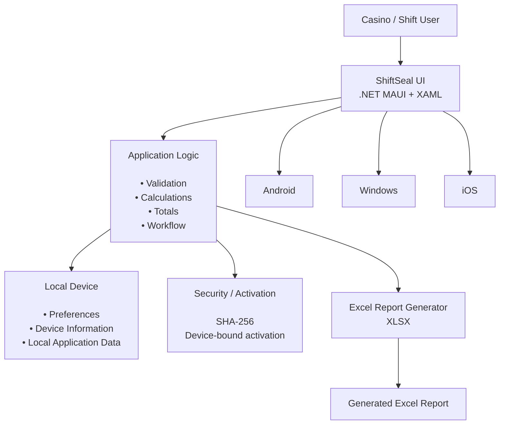

# ShiftSeal-CaseStudy

> **Offline-first digital closer book for casino shift operations**

## Overview

**ShiftSeal** is a cross-platform application built to digitize the traditional casino closer-book process.

It replaces manual calculations and paper-based reporting with a structured digital workflow for entering denomination-wise shift data, automatically calculating totals, and generating Excel reports.

---

## Problem

The traditional process involved:

* Manual denomination calculations
* Paper-based shift records
* Re-entering data into Excel for reporting
* Dependency on manual verification
* Limited availability of digital records

The goal was to create a simple application that could perform the same workflow **accurately and completely offline**.

---

## Solution

ShiftSeal provides:

* Denomination-wise opener/closer entry
* Addition and subtraction tracking
* Automatic closer amount and total calculations
* Input validation
* Excel report generation
* Offline device activation
* Android, iOS and Windows support

---

# Architecture

ShiftSeal follows a pragmatic application architecture focused on **separation of UI, business logic, local processing, and platform-specific functionality**.



The application is intentionally designed without a mandatory backend or internet dependency for its core workflow.

---

## Key Design Decisions

### Offline-First

The application is designed to work without internet connectivity.

**Why?**

The closer-book workflow is operational and should not stop because of network availability.

This also keeps the architecture simple and avoids unnecessary transmission of operational data.

### Automatic Calculations

The application calculates values locally instead of relying on manual arithmetic.

```text
Closer Amount = Opener + Additions - Subtractions
```

This reduces repetitive work and calculation errors.

### SHA-256 & Integrity

SHA-256 is used as part of the application's security/activation design.

A cryptographic hash allows trusted data to be checked later for changes, making it **tamper-evident rather than tamper-proof**.

Sensitive licensing implementation details are intentionally excluded from this public repository.

### Excel Reporting

The completed shift data is converted directly into an `.xlsx` report.

```text
User Input
    ↓
Validation
    ↓
Calculations
    ↓
Excel Generation
    ↓
.xlsx Report
```

This eliminates the need to manually re-enter the closer-book data into Excel.

---

## Technology Stack

* **C#**
* **.NET 8**
* **.NET MAUI**
* **XAML**
* **Android, iOS & Windows**
* **Excel/XLSX**
* **SHA-256**

---

## Engineering Highlights

* Built a cross-platform application from a single .NET codebase
* Designed an offline-first workflow
* Implemented automatic financial/denomination calculations
* Added device-bound offline activation
* Generated structured Excel reports
* Handled responsive layouts across Android / iOS phones, tablets, and Windows

---

## Outcome

ShiftSeal transforms a manual closer-book process into a **faster, more consistent, and digitally reportable workflow**, while keeping the core operation independent of internet connectivity.

> **Repository purpose:** This repository contains the engineering case study and architecture documentation. The production application and private licensing implementation are maintained separately.

---

## Repository Purpose

This repository contains the **ShiftSeal engineering case study** only.

The production application's source code, private licensing implementation, cryptographic secrets, and business-specific configuration are intentionally excluded.

**Project:** ShiftSeal
**Platform:** Android + iOS + Windows
**Framework:** .NET 8 / .NET MAUI
**Focus:** Offline-first digital closer book and reporting
